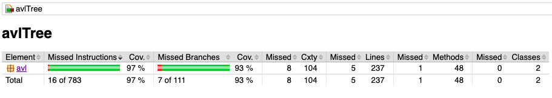
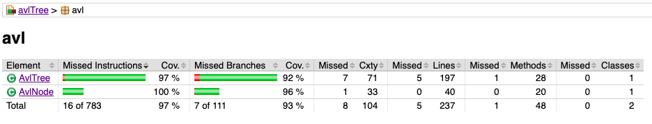
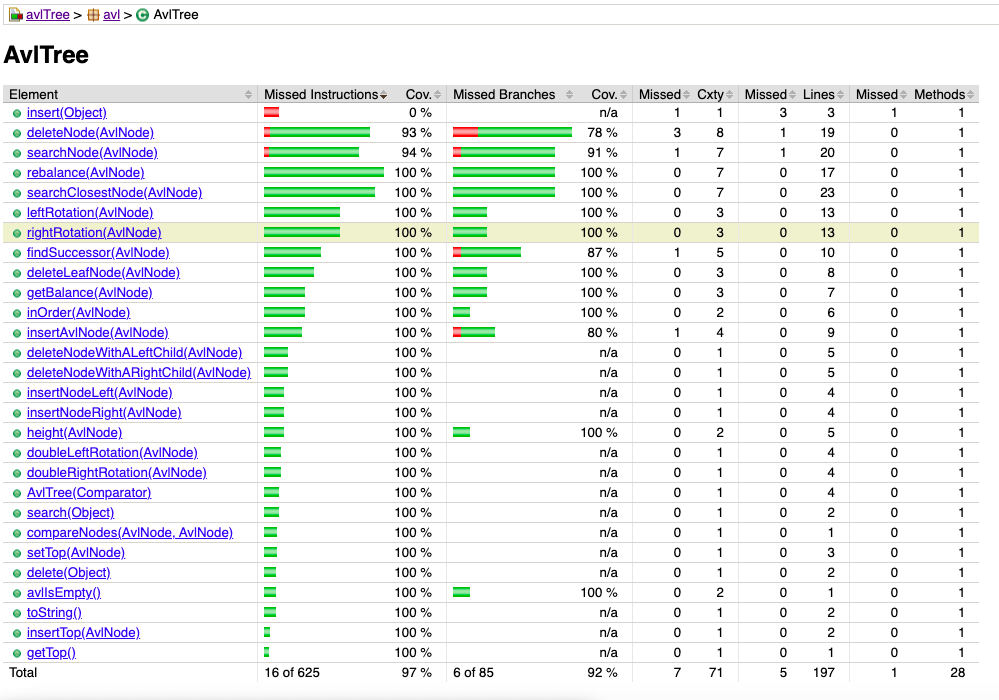
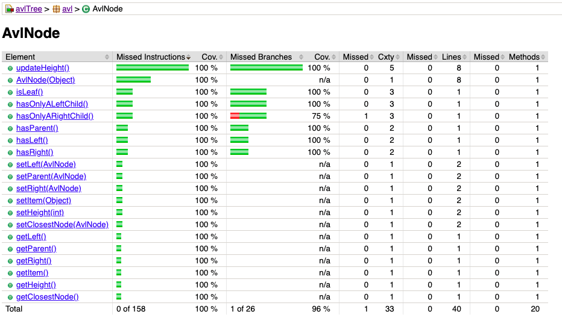

# Ejercicio 8
Realizado por: Álvaro Tapia Muñoz y Christian Berdejo Sánchez

## Jacoco report

Al inicio, como podemos observar en la imagen, el porcentaje de cobertura de linea es del __97%__ y el de cobertura de branch es del __93%.__

Esto se debe a que dentro de la clase `AvlTree` falta por cubrir el método `insert` entero y varias instrucciones de los métodos `deleteNode` y `searchNode`.

Por ejemplo, en el método `searchNode()`hay un error y es que realmente no busca ningun nodo en el arbol y simplemente devuelve el mismo nodo que se le pasa como argumento.

En cambio, como podemos ver en la siguiente imagen, en la clase `AvlNode` el porcentaje de cobertura de linea es del __100%__ y el de cobertura de branch es del __96%__ debido a que falta por cubrir una condición del método `hasOnlyARightChild`

## Calidad del código con Intelij IDEA 
Resultados en la carpeta `CalidadCodigo`

En el html proporcionado podemos ver que el proyecto cuenta con bastantes warnings, algunos son por uso de frameworks que estan deprecated (en este caso Assert de jUnit), tambien podemos ver que muchos de ellos se deben a que se han tipado los argumentos explicitamente, lo cual puede ser reemplazado por <>. 
Para finalizar, Intelij nos indica muchos warnings por typos, los cuales no son errores de compilación pero si de escritura y por ultimo nos muestra propiedades sin usar en el sonar-project.properties.